# Lumivya Technology Bootcamp — Complete Project Documentation

---

## Table of Contents

1. [Project Summary](#1-project-summary)
2. [High-Level Architecture](#2-high-level-architecture)
3. [Module 1 — Data Acquisition (Scraper)](#3-module-1--data-acquisition-scraper)
4. [Module 2 — Data Processing (Normalization)](#4-module-2--data-processing-normalization)
5. [Module 3 — Analytics Bot (AI Agent + UI)](#5-module-3--analytics-bot-ai-agent--ui)
   - [5.1 Analytics Agent Backend](#51-analytics-agent-backend)
   - [5.2 MCP Server](#52-mcp-server)
   - [5.3 Frontend UI](#53-frontend-ui)
   - [5.4 Docker & Load Balancing](#54-docker--load-balancing)
6. [Database Schema](#6-database-schema)
7. [Request & Data Flow](#7-request--data-flow)
8. [Technology Stack](#8-technology-stack)
9. [Environment & Configuration](#9-environment--configuration)
10. [Testing](#10-testing)
11. [Developer Quick Reference](#11-developer-quick-reference)

---

## 1. Project Summary

This is a **full end-to-end data engineering + AI bootcamp project**. It starts by scraping real product data from Amazon, cleans and normalises that data into a relational database, and finally exposes it through an AI-powered conversational analytics agent with a web chat interface.

### What the project does at a glance

| Stage | What happens | Key output |
|-------|-------------|------------|
| **Scrape** | Spider crawls Amazon for Samsung phone listings | Raw CSV file with phone specs |
| **Normalise** | Jupyter notebook transforms the flat CSV into 5 relational tables | `brands`, `operating_systems`, `cpu_models`, `phones`, `phone_specs` CSV / PostgreSQL tables |
| **Serve** | FastAPI backend wraps a LangChain / LangGraph AI agent | REST API compatible with CopilotKit |
| **Chat** | Next.js frontend provides a chat window | End-users can ask plain-English questions about the phone data |

### Key characteristics

- **Multi-phase pipeline** — scrape → normalise → query
- **LLM-agnostic** — supports Groq, Azure OpenAI, OpenAI, and Perplexity as the language model backend
- **Dual database backends** — DuckDB (for local / CSV-based queries) and PostgreSQL (for production)
- **MCP support** — the agent can also call tools over the Model Context Protocol
- **Horizontally scalable** — Docker Compose runs two agent replicas behind an Nginx load balancer
- **Observability** — Langfuse integration for LLM call tracing

---

## 2. High-Level Architecture

The three modules form a sequential pipeline as well as an independently deployable set of services.

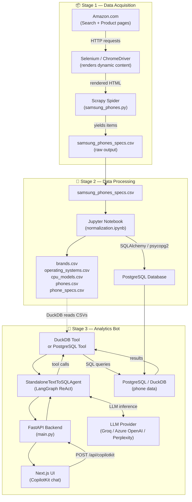

---

## 3. Module 1 — Data Acquisition (Scraper)

**Folder:** `data_aquisition/`

### Purpose

Crawls Amazon's Samsung phone search results across up to 10 pages, then visits each individual product page to extract detailed specifications.

### Folder Structure

```
data_aquisition/
├── scrapy.cfg                  ← Scrapy project config
└── amazon_samsung/
    ├── __init__.py
    ├── items.py                ← Scrapy Item model (placeholder)
    ├── middlewares.py          ← Spider & Downloader middleware hooks
    ├── pipelines.py            ← Item pipeline (pass-through)
    ├── settings.py             ← Global Scrapy settings
    └── spiders/
        └── samsung_phones.py   ← The main spider
```

### How the Spider Works

The spider uses a **two-phase crawl** strategy:

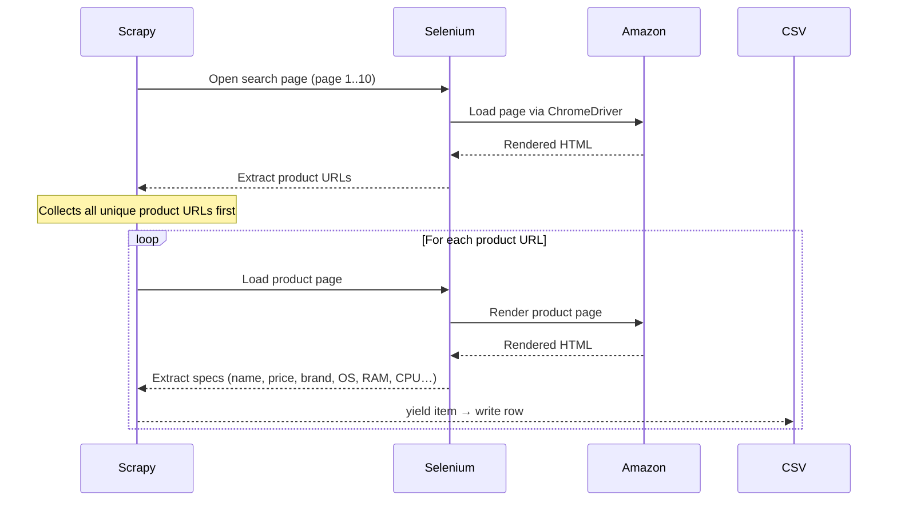

**Phase 1 — Search page crawl (pages 1–10)**
- Scrapy fires a request for each search page URL.
- Selenium renders the page in Chrome to handle Amazon's dynamic JavaScript.
- Product URLs are harvested from `div[data-cy='title-recipe'] a` selectors and stored in a de-duplicated list (`_product_links`).

**Phase 2 — Product page crawl**
- After all search pages are processed, the spider iterates over every collected URL.
- Selenium loads each product page and waits for `#productTitle` to appear (15-second timeout).
- Extracted fields are yielded as a dictionary (Scrapy item).

### Data Extracted Per Product

| Field | CSS Selector |
|-------|-------------|
| `name` | `#productTitle` |
| `price` | `span.a-price span.a-offscreen` |
| `brand` | `.po-brand .po-break-word` |
| `operating_system` | `.po-operating_system .po-break-word` |
| `ram` | `.po-ram_memory\.installed_size .po-break-word` |
| `cpu_model` | `.po-cpu_model\.family .po-break-word` |
| `cpu_speed` | `.po-cpu_model\.speed .po-break-word` |
| `ratings_count` | `#acrCustomerReviewText` |
| `url` | `driver.current_url` |

### Key Settings

| Setting | Value | Reason |
|---------|-------|--------|
| `CONCURRENT_REQUESTS` | `1` | Single shared Selenium driver — must be sequential |
| `DOWNLOAD_DELAY` | `2.0 s` | Throttle to avoid Amazon rate limiting |
| `ROBOTSTXT_OBEY` | `False` | Amazon's robots.txt would block all crawling |
| `FAKEUSERAGENT` | Enabled | Rotates browser User-Agent headers |
| `RETRY_ENABLED` | `False` | Avoids retry storms on blocked requests |

### Running the Scraper

```bash
# Navigate to the project with scrapy.cfg
cd data_aquisition

# Install dependencies
uv pip install scrapy selenium webdriver-manager scrapy-fake-useragent

# Run — output to CSV (overwrite)
uv run scrapy crawl samsung_phones -O samsung_phones_specs.csv

# Run — output to JSON
uv run scrapy crawl samsung_phones -O samsung_phones_specs.json
```

> Use `-o` (lowercase) to **append** to an existing file instead of overwriting it.

---

## 4. Module 2 — Data Processing (Normalization)

**Folder:** `data_processing/`

### Purpose

Transforms the flat, raw CSV from the scraper into a properly structured, 3rd-Normal-Form (3NF) relational database schema. Outputs both normalised CSV files and can load data directly into PostgreSQL.

### Folder Structure

```
data_processing/
├── normalization.ipynb         ← Main Jupyter notebook
└── dataset/                    ← Normalised output CSVs
    ├── brands.csv
    ├── operating_systems.csv
    ├── cpu_models.csv
    ├── phones.csv
    └── phone_specs.csv
```

### Normalization Strategy

The flat CSV has repeated brand names, OS strings, and CPU strings. The notebook deduplicates each dimension into its own lookup table.

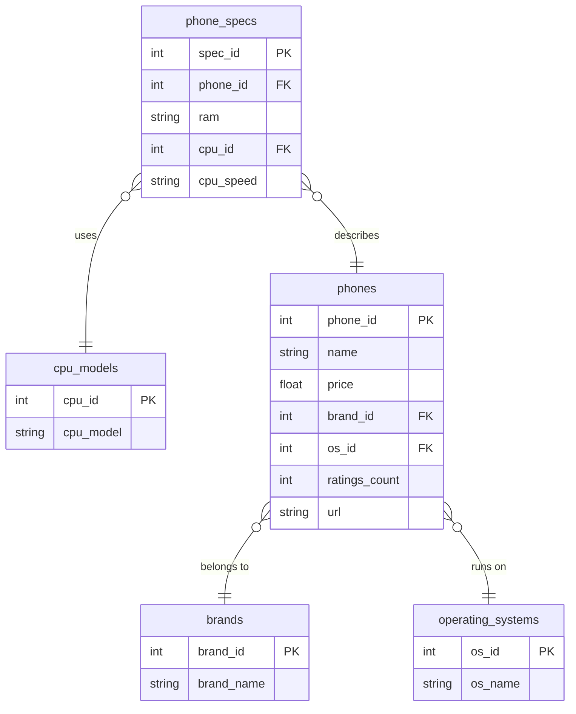

### Normalization Process (step-by-step)

1. **Load raw CSV** — read `samsung_phones_specs.csv` into a Pandas DataFrame.
2. **Handle missing prices** — fill null prices with random values ($300–$1000) for demo purposes.
3. **Extract lookup tables** — deduplicate `brand`, `operating_system`, and `cpu_model` columns into separate DataFrames with integer primary keys.
4. **Build `phones` table** — replace string columns with foreign key IDs from the lookup tables.
5. **Build `phone_specs` table** — extract `ram`, `cpu_id`, and `cpu_speed` from the phones data.
6. **Save CSV files** — write each table to `dataset/`.
7. **Load into PostgreSQL** — optionally push all tables to a PostgreSQL database using SQLAlchemy.

### Normalisation Concepts Applied

| Normal Form | What was fixed |
|-------------|---------------|
| **1NF** | Each column holds atomic values; no repeating groups |
| **2NF** | Non-key attributes depend on the full primary key, not a partial key |
| **3NF** | Transitive dependencies removed (brand, OS, CPU extracted to separate tables) |

---

## 5. Module 3 — Analytics Bot (AI Agent + UI)

**Folder:** `data_bot/`

This is the largest and most complex module. It consists of:

- `analytics_agent/` — Python backend (FastAPI + LangGraph AI agent)
- `ui/` — Next.js frontend chat application

---

### 5.1 Analytics Agent Backend

**Folder:** `data_bot/analytics_agent/`

#### Overview

A FastAPI application that wraps a **LangGraph ReAct agent**. The agent receives natural language questions, decides which SQL tools to call, queries the phone database, and returns a human-readable answer.

#### Project Structure

```
analytics_agent/
├── Dockerfile
├── docker-compose.yaml
├── Makefile
├── pyproject.toml
└── src/
    ├── main.py                          ← FastAPI app (CopilotKit / AG-UI endpoint)
    ├── main_mcp.py                      ← Interactive CLI using MCP tools
    ├── text_summarizer.py                ← Standalone text summarisation utility
    ├── config/
    │   ├── settings.py                  ← Pydantic Settings (env vars)
    │   ├── dependencies.py              ← Dependency injection (db_tool, user_input_tool)
    │   └── langfuse.py                  ← Langfuse observability setup
    ├── analytics_agents/
    │   ├── standalone_text_to_sql_agent.py  ← The main LangGraph ReAct agent
    │   └── tools/
    │       ├── tool.py                  ← Abstract base class (Tools interface)
    │       ├── duckdb.py                ← DuckDB tool implementation
    │       ├── postgres_tool.py         ← PostgreSQL tool implementation
    │       └── user_input.py            ← Tool for asking the user questions
    └── mcp_server/
        └── main.py                      ← FastMCP server (exposes tools via MCP)
```

#### Agent Architecture

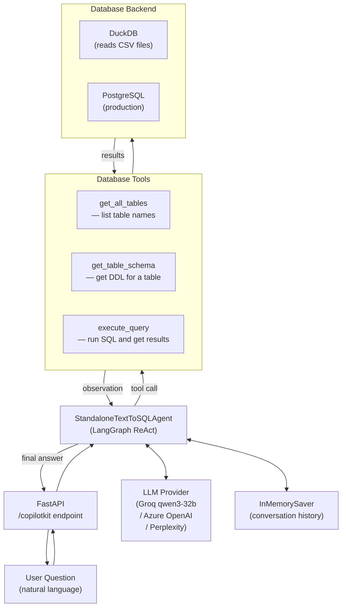

#### The ReAct Loop

The agent follows the **Thought → Action → Observation** pattern on every question:

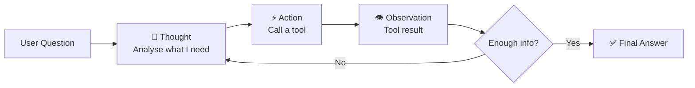

**Example interaction for "What is the most expensive Samsung phone?"**

1. **Thought**: I need to know which tables are available.
2. **Action**: `get_all_tables()`
3. **Observation**: `brands, cpu_models, operating_systems, phones, phone_specs`
4. **Thought**: I need the schema for `phones`.
5. **Action**: `get_table_schema("phones")`
6. **Observation**: DDL showing `phone_id, name, price, brand_id, os_id, ratings_count, url`
7. **Thought**: Now I can write the SQL.
8. **Action**: `execute_query("SELECT name, price FROM phones ORDER BY price DESC LIMIT 1")`
9. **Observation**: `[["Samsung Galaxy S10+ Plus ...", 963.0]]`
10. **Final Answer**: "The most expensive Samsung phone in the dataset is the Samsung Galaxy S10+ Plus at $963.00."

#### LLM Provider Support

The agent can be instantiated with different LLM backends through factory class methods:

| Method | Provider | Model Used |
|--------|----------|-----------|
| `from_groq()` | Groq | `qwen/qwen3-32b` |
| `from_azure_llm_config()` | Azure OpenAI | Configurable via `LLM_CONFIG` |
| `from_perplexity()` | Perplexity | `sonar-reasoning-pro` |
| `from_llm()` | Any LangChain `BaseChatModel` | Custom |

#### Database Tool Abstraction

All database tools implement the abstract `Tools` interface (`tool.py`), following a **Port-Adapter pattern**:

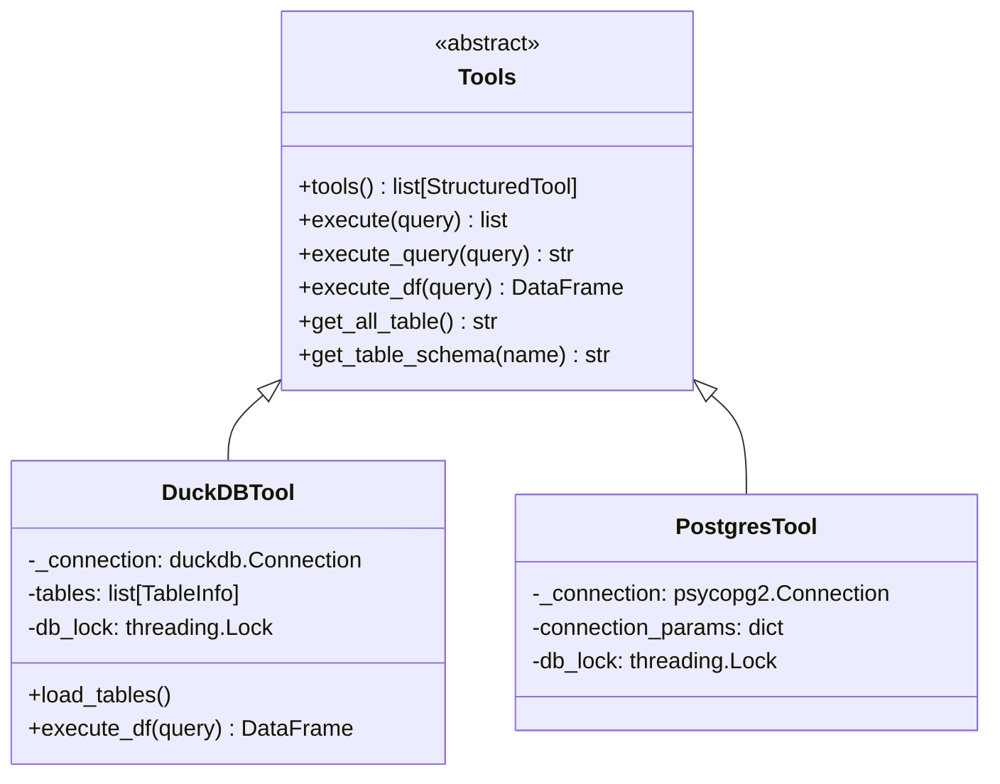

- **DuckDB** loads CSV files via `CREATE TABLE ... AS SELECT * FROM read_csv('...')` on startup and holds an in-memory database. Good for local development.
- **PostgreSQL** connects to a live PostgreSQL server using `psycopg2`. Used in production.

Currently `dependencies.py` defaults to **PostgreSQL** (DuckDB path is commented out).

#### Langfuse Observability

Every LLM call is traced through **Langfuse**, allowing you to see the full chain of prompts, tool calls, tokens used, and latencies in the Langfuse dashboard.

```python
# config/langfuse.py
languse_callback = CallbackHandler()   # passed as LangGraph callback
```

---

### 5.2 MCP Server

**File:** `data_bot/analytics_agent/src/mcp_server/main.py`

An alternative way to expose the database tools using the **Model Context Protocol (MCP)**. Built with **FastMCP**.

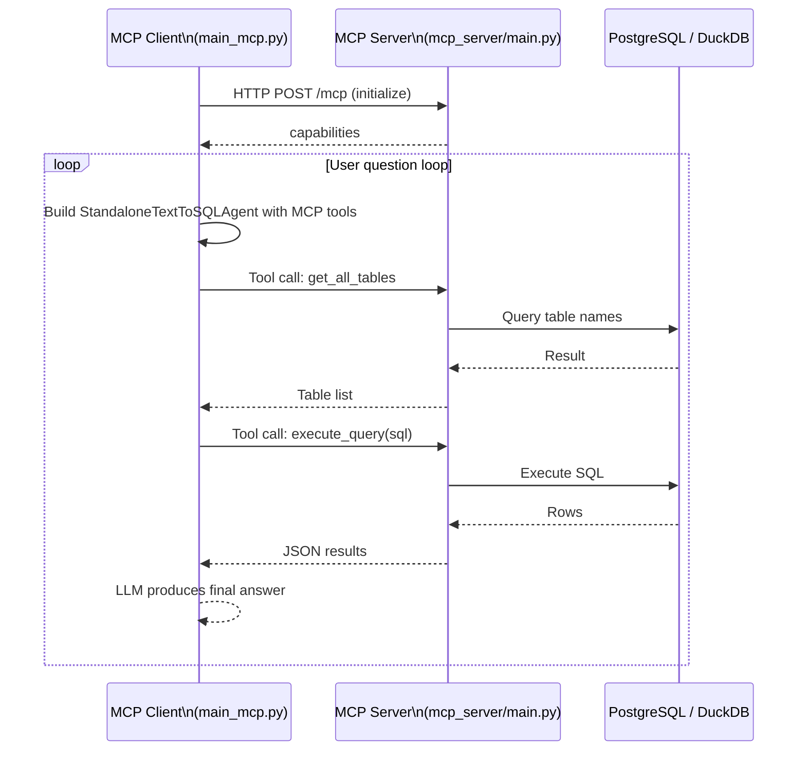

**MCP tools exposed:**

| Tool | Description |
|------|-------------|
| `execute_query(query)` | Runs a SQL query, returns JSON (max 100 rows) |
| `get_all_tables()` | Returns all table names as a comma-separated string |
| `get_table_schema(table_name)` | Returns CREATE TABLE DDL for the given table |

Run the server:
```bash
make mcp_serve         # start MCP HTTP server on port 8000
make mcp_inspector     # open FastMCP dev inspector
```

---

### 5.3 Frontend UI

**Folder:** `data_bot/ui/`

A **Next.js 16** application providing a chat interface powered by **CopilotKit**.

#### Structure

```
ui/
├── package.json
├── next.config.ts
└── app/
    ├── layout.tsx               ← Wraps app in <CopilotKit> provider
    ├── page.tsx                 ← Chat page (renders <CopilotChat>)
    └── api/
        └── copilotkit/
            └── route.ts         ← Next.js API route bridging UI ↔ Agent
```

#### How It Works

```mermaid
sequenceDiagram
    participant Browser
    participant Next["Next.js\n/api/copilotkit"]
    participant Agent["FastAPI Agent\n:3050 /copilotkit"]

    Browser->>Next: User types question → POST /api/copilotkit
    Next->>Agent: Forward via LangGraphHttpAgent\n(AGENT_URL env var, default :8123)
    Agent-->>Next: Streaming response (AG-UI protocol)
    Next-->>Browser: Stream tokens to CopilotChat component
```

- `layout.tsx` wraps everything in `<CopilotKit runtimeUrl="/api/copilotkit">` — this sets up the CopilotKit context for all child components.
- `page.tsx` renders the `<CopilotChat>` component which shows the chat window.
- `route.ts` creates a `CopilotRuntime` pointing at the FastAPI backend via `LangGraphHttpAgent`. The agent URL defaults to `http://localhost:8123` but can be overridden with the `AGENT_URL` environment variable.

#### Running the UI

```bash
cd data_bot/ui
pnpm install
pnpm dev           # development server on http://localhost:3000
pnpm dev:network   # accessible on local network (0.0.0.0)
```

---

### 5.4 Docker & Load Balancing

The analytics agent backend is fully containerised and supports **horizontal scaling** with Nginx.

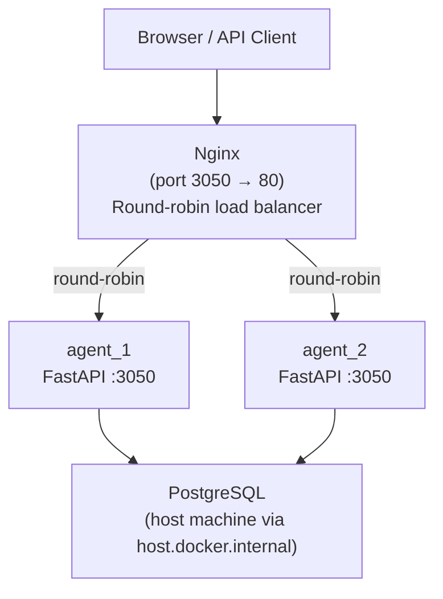

**docker-compose.yaml** spins up:
- `agent_1` and `agent_2` — identical FastAPI app containers built from the same `Dockerfile`
- `nginx` — reverse proxy that load-balances between the two agent containers

All containers share the `loadbalancing` Docker network. PostgreSQL runs on the host machine and is accessed via the special `host.docker.internal` hostname.

**Dockerfile summary:**
```dockerfile
FROM python:3.12-slim-trixie
# Copies uv from Astral's official image
WORKDIR /app
RUN uv sync --no-cache        # install dependencies from pyproject.toml
ADD src /app/src
CMD ["uv", "run", "/app/src/main.py"]
```

**Make targets for Docker:**

| Command | Action |
|---------|--------|
| `make docker_build` | Build a single Docker image |
| `make docker_run` | Build + run a single container on port 3050 |
| `make loadbalance` | `docker compose up --build` (2 agents + nginx) |
| `make loadbalance_rm` | `docker compose down` |

---

### 5.5 Text Summariser (Utility)

**File:** `data_bot/analytics_agent/src/text_summarizer.py`

A simple, standalone LangChain pipeline that summarises any piece of text using an LLM and returns a structured `SummaryOutput` (title + summary). Demonstrates using `PromptTemplate` + `PydanticOutputParser` for structured output.

```
Text Input → PromptTemplate → Groq LLM (llama-3.1-8b-instant) → PydanticOutputParser → SummaryOutput { title, summary }
```

Run: `make run_summarizer`

---

## 6. Database Schema

The final normalised schema stored in both CSV files and PostgreSQL:

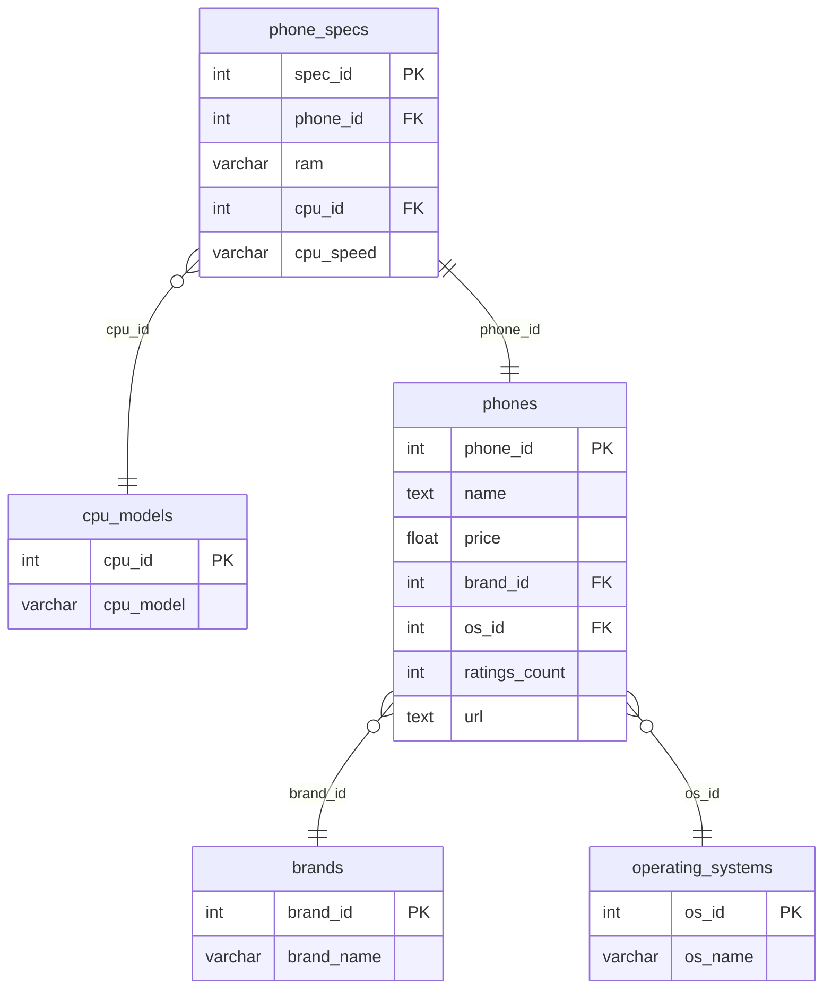

### Table Descriptions

| Table | Rows (approx.) | Description |
|-------|---------------|-------------|
| `brands` | ~5–10 | Unique phone brand names (Samsung, Verizon, etc.) |
| `operating_systems` | ~20 | Unique OS strings (Android versions, One UI versions) |
| `cpu_models` | ~20 | Unique CPU families (Snapdragon, Exynos, MediaTek, etc.) |
| `phones` | ~200+ | One row per scraped phone listing (name, price, FKs, URL) |
| `phone_specs` | ~200+ | Technical specs for each phone (RAM, CPU, speed) |

---

## 7. Request & Data Flow

### Full End-to-End User Query Flow

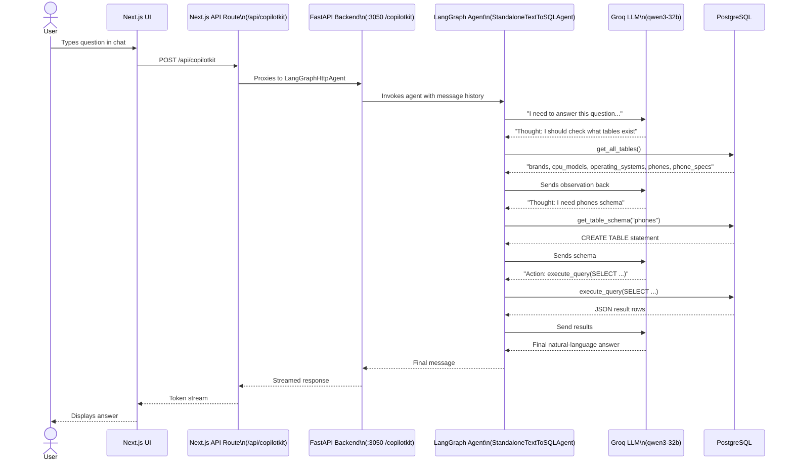

### Scraper Data Flow

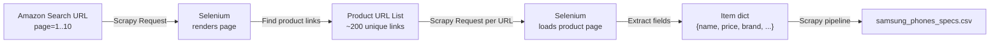

---

## 8. Technology Stack

### Backend (Python)

| Library | Purpose |
|---------|---------|
| `scrapy` | Web crawling framework |
| `selenium` + `webdriver-manager` | Browser automation for dynamic page rendering |
| `scrapy-fake-useragent` | Rotate user-agent headers to reduce blocking |
| `fastapi` + `uvicorn` | REST API server |
| `langchain` | LLM tooling, chains, prompt templates |
| `langchain-groq` | Groq LLM integration |
| `langchain-openai` | Azure / OpenAI integration |
| `langgraph` | Graph-based agentic workflow orchestration |
| `duckdb` | In-memory SQL engine (reads CSV files) |
| `psycopg2-binary` | PostgreSQL driver |
| `pandas` | Data manipulation for normalisation |
| `pydantic` + `pydantic-settings` | Data validation and settings management |
| `langfuse` | LLM observability and tracing |
| `mcp` + `fastmcp` | Model Context Protocol server/client |
| `langchain-mcp-adapters` | Bridge between MCP tools and LangChain |
| `copilotkit` | Agent UI protocol (AG-UI) |
| `ag-ui-langgraph` | AG-UI integration for LangGraph agents |

### Frontend (TypeScript / Node.js)

| Library | Purpose |
|---------|---------|
| `next` (v16) | React framework (App Router) |
| `react` (v19) | UI rendering |
| `@copilotkit/react-core` | CopilotKit context provider |
| `@copilotkit/react-ui` | Pre-built chat UI components |
| `@copilotkit/runtime` | Server-side CopilotKit runtime |
| `tailwindcss` (v4) | Utility-first CSS styling |
| `typescript` | Type safety |

### Infrastructure

| Tool | Purpose |
|------|---------|
| `Docker` | Container runtime |
| `Docker Compose` | Multi-container orchestration |
| `Nginx` | Reverse proxy and round-robin load balancer |
| `PostgreSQL` | Production-grade relational database |
| `uv` | Fast Python package manager (replaces pip/poetry) |
| `pnpm` | Fast Node.js package manager |

---

## 9. Environment & Configuration

### Analytics Agent `.env` Variables

| Variable | Required | Default | Purpose |
|----------|----------|---------|---------|
| `PORT` | No | `3050` | FastAPI server port |
| `HOST` | No | `0.0.0.0` | FastAPI bind address |
| `DEBUG` | No | `False` | Enable debug mode |
| `RELOAD` | No | `True` | Hot-reload (dev mode) |
| `GROQ_API_KEY` | Yes (if using Groq) | — | Groq API key |
| `OPENAI_API_KEY` | Yes (if using OpenAI) | — | OpenAI API key |
| `LLM_CONFIG` | Yes (if using Azure) | — | JSON config for Azure OpenAI |
| `GEMINI_KEY` | Yes (if using Gemini) | — | Google Gemini key |
| `PERPLEXITY_KEY` | Yes (if using Perplexity) | — | Perplexity API key |
| `POSTGRES_HOST` | Yes | `localhost` | PostgreSQL host |
| `POSTGRES_PORT` | Yes | `5432` | PostgreSQL port |
| `POSTGRES_DB` | Yes | — | Database name |
| `POSTGRES_USER` | Yes | — | Database username |
| `POSTGRES_PASSWORD` | Yes | — | Database password |
| `DATA_BASE_PATH` | No | `.` | Base path for CSV files (DuckDB) |
| `LANGFUSE_SECRET_KEY` | No | — | Langfuse secret key |
| `LANGFUSE_PUBLIC_KEY` | No | — | Langfuse public key |
| `LANGFUSE_BASE_URL` | No | — | Langfuse API URL |
| `LANGFUSE_ENVIRONMENT` | No | — | Langfuse environment label |

### Frontend `.env` Variables

| Variable | Default | Purpose |
|----------|---------|---------|
| `AGENT_URL` | `http://localhost:8123` | URL of the FastAPI agent backend |

---

## 10. Testing

Tests live in `data_bot/analytics_agent/tests/`.

```
tests/
├── conftest.py                          ← Shared pytest fixtures
├── agents/
│   └── test_standalone_text_to_sql_agent.py
└── tools/
    ├── test_duckdb_tool.py
    └── test_user_input_tool.py
```

- **`conftest.py`** — sets up a `duckdb_tool` fixture that loads CSV tables (using the Olist e-commerce dataset for tests) and a `llm_config` fixture from environment variables.
- **`test_standalone_text_to_sql_agent.py`** — parametrised integration tests that ask real NL questions and verify the agent produces a response.
- The agent is tested using Azure OpenAI via `from_azure_llm_config()`.

Running tests:
```bash
cd data_bot/analytics_agent
uv run --env-file .env pytest tests/ -s
```

---

## 11. Developer Quick Reference

### Entire Pipeline from Zero

```bash
# ── Step 1: Scrape Data ──────────────────────────────────
cd data_aquisition
uv pip install scrapy selenium webdriver-manager scrapy-fake-useragent
uv run scrapy crawl samsung_phones -O amazon_samsung/samsung_phones_specs.csv

# ── Step 2: Normalise Data ───────────────────────────────
# Open data_processing/normalization.ipynb in Jupyter and run all cells
# Outputs: data_processing/dataset/*.csv
# Optionally loads into PostgreSQL

# ── Step 3: Start the Agent Backend ─────────────────────
cd data_bot/analytics_agent
cp .env.example .env          # fill in your API keys and DB credentials
uv sync && uv sync --dev
make run_ui                    # starts FastAPI on :3050

# ── Step 4: Start the Frontend ──────────────────────────
cd data_bot/ui
pnpm install
pnpm dev                       # starts Next.js on http://localhost:3000
```

### MCP Mode (Alternative)

```bash
# Terminal 1 — start MCP server
cd data_bot/analytics_agent
make mcp_serve

# Terminal 2 — run interactive CLI client
make run_mcp
```

### Docker Production Deployment

```bash
cd data_bot/analytics_agent
make loadbalance               # starts 2 agents + nginx on port 3050
make loadbalance_rm            # tear down
```

### Make Targets Summary

| Target | Command | Description |
|--------|---------|-------------|
| `run_ui` | `uv run src/main.py` | Start FastAPI (CopilotKit mode) |
| `run_mcp` | `uv run src/main_mcp.py` | Start MCP CLI client |
| `mcp_serve` | `uv run src/mcp_server/main.py` | Start MCP HTTP server |
| `mcp_inspector` | `fastmcp dev src/mcp_server/main.py` | Open MCP dev inspector |
| `run_summarizer` | `uv run src/text_summarizer.py` | Run text summariser |
| `docker_build` | `docker build -t analytics_agent .` | Build Docker image |
| `docker_run` | Build + run single container | Single container on :3050 |
| `loadbalance` | `docker compose up --build` | 2 agents + Nginx |
| `loadbalance_rm` | `docker compose down` | Tear down compose stack |
